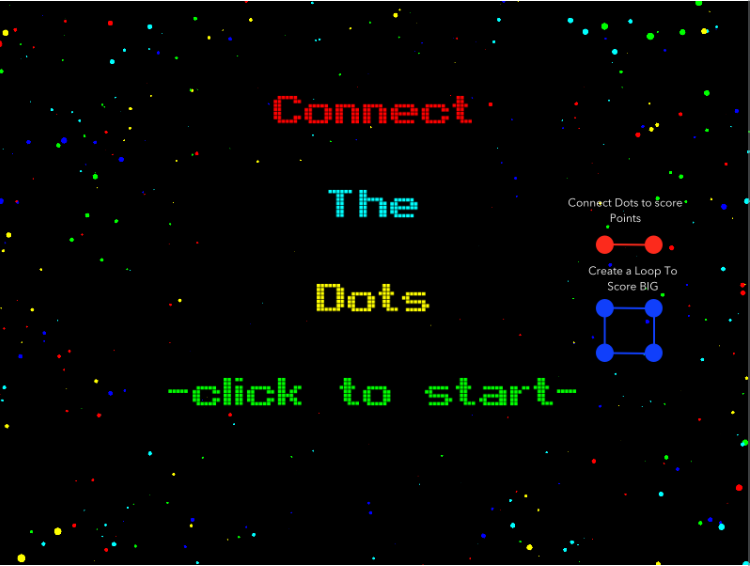

#Connect The Dots

Basic connect the dots game [here](http://divideby5.com/games/ctd/).

Connect as many dots as you can in 20 moves.  Bonus points for closing a loop

Developed using [Phaser.js](http://phaser.io)

SFX - Made using [cfxr](http://thirdcog.eu/apps/cfxr)

Sprites

* Drawn at runtime using bitmap data.

